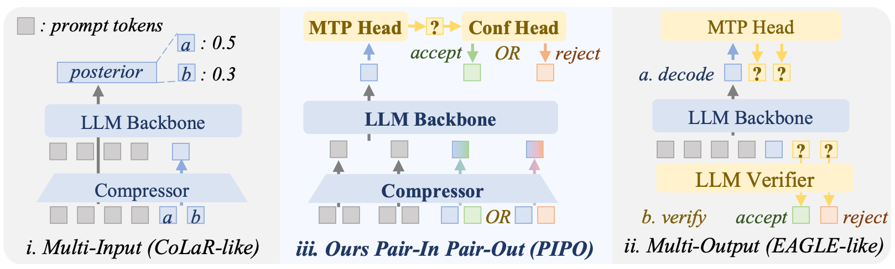
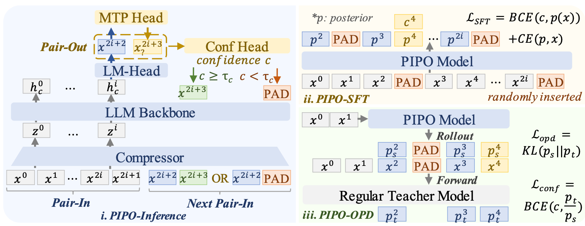
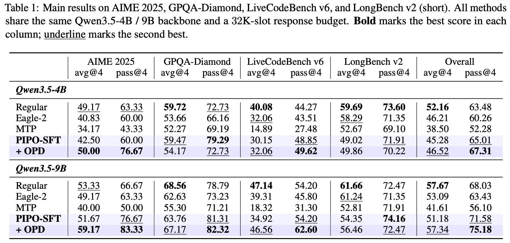

# 💡 [arXiv 2605] Pair-In, Pair-Out: Latent Multi-Token Prediction for Efficient LLMs

Wenhui Tan<sup>1</sup>, Minghao Li<sup>2</sup>, Xiaoqian Ma<sup>2</sup>, Siqi Fan<sup>3</sup>, Xiusheng Huang<sup>4</sup>, Liujie Zhang<sup>2</sup>, Ruihua Song<sup>1</sup>, Weihang Chen<sup>2</sup>

<sup>1</sup> Gaoling School of Artificial Intelligence, Renmin University of China
<sup>2</sup> AI Platform, Xiaohongshu Inc.
<sup>3</sup> University of Electronic Science and Technology of China
<sup>4</sup> Institute of Automation, Chinese Academy of Sciences

<p>
  <a href="https://arxiv.org/abs/2605.27255">
    
  </a>
  <a href="https://huggingface.co/AlbertTan/PIPO">
    
  </a>
  <a href="https://huggingface.co/datasets/AlbertTan/PIPO">
    
  </a>
</p>

<p align="center">
  
</p>

Long chain-of-thought reasoning has made autoregressive decoding the dominant inference cost of modern large language models.
Existing methods target either the input side (latent compression) or the output side (speculative decoding and multi-token prediction, MTP), but the two lines of work have been pursued independently.
Moreover, output-side methods must incur an expensive verifier pass to validate the unreliable draft tokens predicted by MTP.
To address these issues, we propose **Pair-In, Pair-Out (PIPO)**, which unifies both sides by viewing a latent compressor and an MTP head as mirror-image operations: the compressor folds two input tokens into one latent representation, while the MTP head unfolds one hidden state into one additional output token.
To remove the verifier cost without sacrificing reliability, PIPO trains a lightweight confidence head that decides whether draft tokens should be accepted.
We observe that On-Policy Distillation (OPD) naturally matches the rejection-sampling criterion of speculative decoding, so the confidence head can be trained alongside OPD with negligible extra cost.
Experiments on AIME 2025, GPQA-Diamond, LiveCodeBench v6, and LongBench v2 with Qwen3.5-4B and 9B backbones show that PIPO improves pass@4 over regular decoding by up to +7.15 points, while delivering up to 2.64× first-token-latency and 2.07× per-token-latency speedups.

<p align="center">
  
</p>

<p align="center">
  
</p>


## ⚙️ Environment Setup

```bash
conda create -n pipo python=3.12 -y
conda activate pipo

bash scripts/install.sh
```


## 🚀 Evaluate PIPO and baseline methods

### 0. Download the checkpoints, models, and eval benchmarks from Hugging Face

The trained checkpoints are available on [Hugging Face](https://huggingface.co/AlbertTan/PIPO).
Download the `outputs/` directory into `/path/to/PIPO/`. You should then see files like:

```
outputs/Qwen3.5-4B/sft_mlp_sft_all_65535_0.25_2epochs/checkpoint-1500/
```

Then download the base models and benchmarks from Hugging Face:
```
bash scripts/download.sh
```

### 1. Merge LoRA weights

```bash
bash scripts/merge_lora.sh outputs/Qwen3.5-4B/sft_mlp_sft_all_65535_0.25_2epochs/checkpoint-1500
```

This produces a sibling directory with merged weights:
`outputs/Qwen3.5-4B/sft_mlp_sft_all_65535_0.25_2epochs/checkpoint-1500-merged`.

### 2. Launch the evaluation

```bash
python sglang_eval.py --model_path=outputs/Qwen3.5-4B/sft_mlp_sft_all_65535_0.25_2epochs/checkpoint-1500-merged
```

Results are saved under `<model_path>/eval/`.

### 3. Evaluate baseline methods

Regular decoding:

```bash
python sglang_eval.py --model_path=Qwen/Qwen3.5-4B
```

Qwen3.5's native MTP head with EAGLE-2 speculative decoding:

```bash
python sglang_eval.py --model_path=Qwen/Qwen3.5-4B --enable_eagle
```


## 🚀 Train PIPO

### 0. Download the dataset

SFT and OPD training data are available on [Hugging Face](https://huggingface.co/datasets/AlbertTan/PIPO).
Download the `data/` directory into `/path/to/PIPO/`. You should then see files like `data/sft_all.jsonl` and `data/rl_0.5.jsonl`.

### 1. [Recommended] Cache the SFT dataset

We recommend caching the SFT dataset to avoid re-processing it on every run.

```bash
bash pipo/dataset/export_cached_dataset.sh data/sft_all.jsonl
```

This produces files like `data/sft_all.jsonl.cache/train`.

### 2. SFT training

Running `scripts/swift_sft.sh` with no arguments reproduces our default SFT setting.

```bash
bash scripts/swift_sft.sh
```

### 3. OPD training

Running `scripts/swift_opd.sh` with the merged SFT checkpoint reproduces our default OPD setting.

```bash
bash scripts/swift_opd.sh outputs/Qwen3.5-4B/sft_mlp_sft_all_65535_0.25_2epochs/checkpoint-1500-merged
```


## [Optional] Regenerate training data from teacher rollouts

Use the 9B teacher to roll out trajectories:

```bash
python sglang_eval.py \
    --model_path=Qwen/Qwen3.5-9B \
    --max_generated_tokens=128000 \
    --datasets=dapo_math,codeforces
```

Convert the rollout results into SFT data:

```bash
python pipo/dataset/build_sft_data_on_results_jsonl.py \
    outputs/Qwen3.5-9B/regular/4_1.0_0.95_20_0_1.0_1.5_128000/codeforces-results.jsonl \
    outputs/Qwen3.5-9B/regular/4_1.0_0.95_20_0_1.0_1.5_128000/dapo_math-results.jsonl
```

Or into RL/OPD data:

```bash
python pipo/dataset/build_rl_data_on_results_jsonl.py \
    outputs/Qwen3.5-9B/regular/4_1.0_0.95_20_0_1.0_1.5_128000/codeforces-results.jsonl \
    outputs/Qwen3.5-9B/regular/4_1.0_0.95_20_0_1.0_1.5_128000/dapo_math-results.jsonl
```


## 🐛 Known Issues

Contributions to address any of the following are very welcome.

1. **Radix cache is disabled when PIPO is enabled.** We observe cache-key mismatches between the compressed pair-latent representation and SGLang's prefix hash; the radix cache is therefore force-disabled in the PIPO inference path.
2. **The prefill stage does not emit a draft token (token2)** because of CUDA-graph constraints. A PAD token is automatically inserted after the backbone token (token1).
3. **`enable_memory_saver` / `SLEEP_LEVEL` are unsupported on the SGLang + ms-swift OPD path.** OPD therefore needs ~130 GB / GPU, while SFT only needs ~75 GB / GPU.
4. **Only Qwen3.5 backbones are supported** at the moment.


## 🤖 Vibe-Coding with PIPO:
Please ask your agents to read `.agents/PIPO.md` before working, to let them comprehensively understand PIPO & this repo.


## 📜 Citation

If you use this code or dataset, please cite our paper:

```bibtex
@article{tan2026pipo,
  title   = {Pair-In, Pair-Out: Latent Multi-Token Prediction for Efficient LLMs},
  author  = {Tan, Wenhui and Li, Minghao and Ma, Xiaoqian and Fan, Siqi and Huang, Xiusheng and Zhang, Liujie and Song, Ruihua and Chen, Weihang},
  journal = {arXiv preprint arXiv:2605.27255},
  year    = {2026}
}
```


## Acknowledgements

We thank the authors of [SGLang](https://github.com/sgl-project/sglang) and [ms-swift](https://github.com/modelscope/ms-swift), whose work we have modified and extended for our research.
